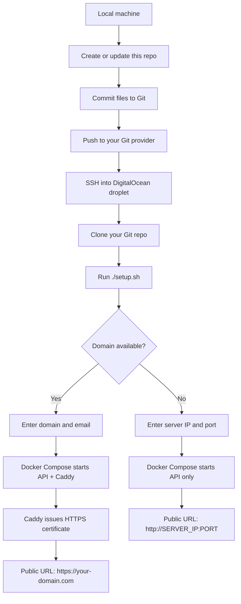
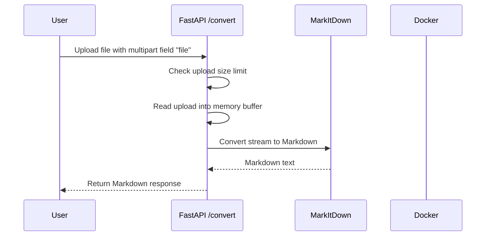
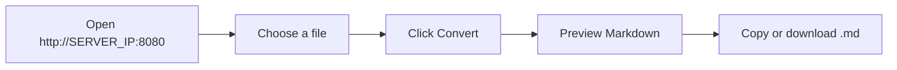

# MarkItDown Web API

A small Dockerized API wrapper around Microsoft MarkItDown for deploying on a DigitalOcean droplet.

## What This Deploys

- `POST /convert`: upload a file and receive Markdown text
- `GET /health`: health check
- `GET /`: browser upload interface
- Optional HTTPS with Caddy when you have a domain
- Plain `http://SERVER_IP:PORT` mode when you do not have a domain
- No API key requirement
- No stored upload files or generated Markdown files

## Local Files

- `app/main.py`: FastAPI wrapper around `markitdown`
- `Dockerfile`: builds the API container
- `docker-compose.port.yml`: IP and port deployment
- `docker-compose.domain.yml`: domain deployment with Caddy HTTPS
- `setup.sh`: interactive droplet setup script

## Full Workflow

This project is designed so you prepare the deployment code locally, push it to your own Git repository, then pull and run it on a DigitalOcean droplet.



Once deployed, requests flow through the service like this:



Browser usage works the same way:



Deployment mode depends on whether you have a domain:

| Situation | Script Behavior | Final URL |
|----------|-----------------|-----------|
| Domain is available | Starts API container and Caddy reverse proxy | `https://your-domain.com` |
| No domain | Starts API container directly on a public port | `http://SERVER_IP:8080` |

## First-Time DigitalOcean Deployment

Use this when the droplet is new or the project has never been deployed on it.

### 1. Create the Droplet

In DigitalOcean, create an Ubuntu droplet. After it is created, copy the public IPv4 address.

Example:

```text
206.81.13.172
```

### 2. SSH Into the Droplet

```bash
ssh root@YOUR_DROPLET_IP
```

Example:

```bash
ssh root@206.81.13.172
```

### 3. Install Git

```bash
apt update
apt install -y git
```

### 4. Clone This Public Repository

```bash
git clone https://github.com/anirban5400/markitdown.git
cd markitdown
```

### 5. Run the Setup Script

```bash
chmod +x setup.sh
./setup.sh
```

The script asks for:

- server IP
- domain name, optional
- email for HTTPS certificates, only when using a domain
- public port, defaults to `8080` when no domain is used
- max upload size, defaults to `50` MB

### 6. Answers When You Do Not Have a Domain

If the script asks:

```text
Server public IP [206.81.13.172]:
```

Press Enter if the detected IP is correct. Do not type `8080` here. This question is asking for the server IP address.

When it asks:

```text
Domain name, leave blank to use IP:port:
```

Press Enter.

When it asks:

```text
Public port [8080]:
```

Press Enter to use `8080`, or type another port.

When it asks:

```text
Max upload size in MB [50]:
```

Press Enter to use `50` MB.

After setup finishes, open:

```text
http://YOUR_DROPLET_IP:8080
```

Example:

```text
http://206.81.13.172:8080
```

### 7. Answers When You Have a Domain

Before using domain mode, point your domain DNS to the droplet:

```text
Type: A
Name: your subdomain or @
Value: YOUR_DROPLET_IP
```

Then run `./setup.sh`.

When it asks for the domain, enter your domain:

```text
markitdown.example.com
```

When it asks for email, enter a real email address. Caddy uses it for HTTPS certificate notices.

After setup finishes, open:

```text
https://markitdown.example.com
```

## Redeploy After Code Updates

Use this every second time, third time, or any time you update the project and push changes to GitHub.

### 1. Push Changes From Your Local Machine

```bash
git add .
git commit -m "Update MarkItDown app"
git push
```

### 2. SSH Into the Droplet

```bash
ssh root@YOUR_DROPLET_IP
```

Example:

```bash
ssh root@206.81.13.172
```

### 3. Pull Latest Code and Redeploy

```bash
cd markitdown
git pull
./setup.sh
```

Use the same answers you used before. For IP-only mode, that usually means:

```text
Server public IP [206.81.13.172]:
```

Press Enter.

```text
Domain name, leave blank to use IP:port:
```

Press Enter.

```text
Public port [8080]:
```

Press Enter.

```text
Max upload size in MB [50]:
```

Press Enter.

The script rebuilds the Docker image and restarts the service.

## Useful Droplet Commands

Check running containers:

```bash
docker ps
```

View logs in IP-only mode:

```bash
docker compose -f docker-compose.port.yml logs -f
```

View logs in domain mode:

```bash
docker compose -f docker-compose.domain.yml logs -f
```

Restart IP-only mode manually:

```bash
docker compose -f docker-compose.port.yml up -d --build
```

Restart domain mode manually:

```bash
docker compose -f docker-compose.domain.yml up -d --build
```

## Usage

Open the deployed URL in a browser:

```text
http://YOUR_IP:8080
```

If you deployed with a domain:

```text
https://markitdown.example.com
```

Convert with curl:

```bash
curl -X POST -F "file=@document.pdf" http://YOUR_IP:8080/convert
```

With a domain:

```bash
curl -X POST -F "file=@document.pdf" https://markitdown.example.com/convert
```

## Security Notes

This service accepts documents and runs conversion code on them. It does not intentionally store uploaded files or generated Markdown files, and responses use `Cache-Control: no-store`. For public deployment, keep the max upload size reasonable and avoid adding endpoints that convert arbitrary server-side URLs.
