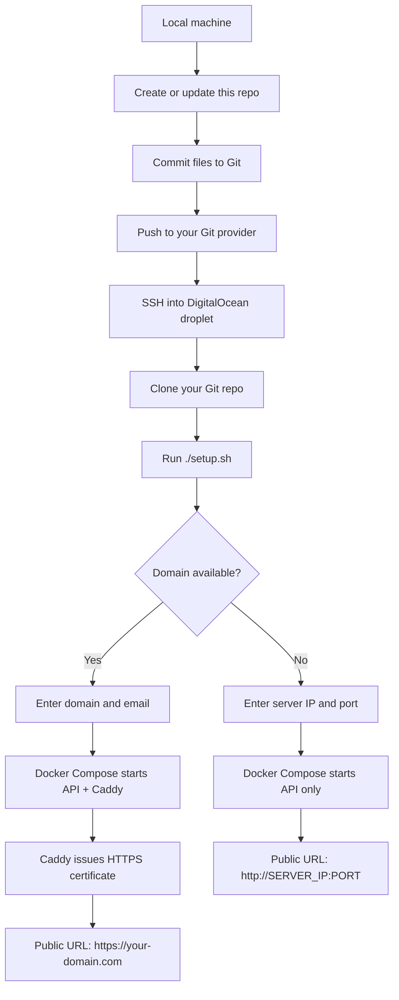
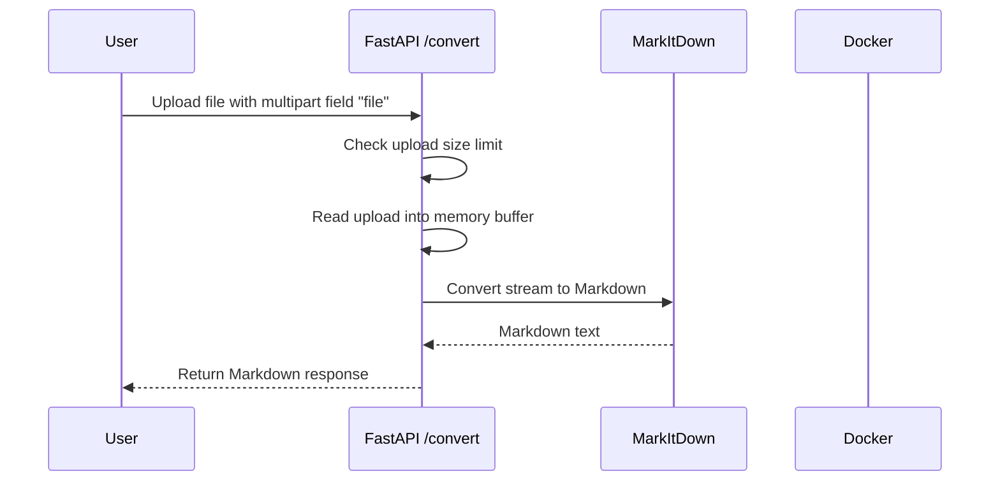
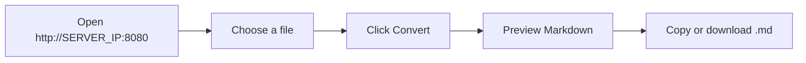

# MarkItDown Web API

A small Dockerized API wrapper around Microsoft MarkItDown for deploying on a DigitalOcean droplet.

## What This Deploys

- `POST /convert`: upload a file and receive Markdown text
- `GET /health`: health check
- `GET /`: browser upload interface
- Optional HTTPS with Caddy when you have a domain
- Plain `http://SERVER_IP:PORT` mode when you do not have a domain
- No API key requirement
- No stored upload files or generated Markdown files

## Local Files

- `app/main.py`: FastAPI wrapper around `markitdown`
- `Dockerfile`: builds the API container
- `docker-compose.port.yml`: IP and port deployment
- `docker-compose.domain.yml`: domain deployment with Caddy HTTPS
- `setup.sh`: interactive droplet setup script

## Full Workflow

This project is designed so you prepare the deployment code locally, push it to your own Git repository, then pull and run it on a DigitalOcean droplet.



Once deployed, requests flow through the service like this:



Browser usage works the same way:



Deployment mode depends on whether you have a domain:

| Situation | Script Behavior | Final URL |
|----------|-----------------|-----------|
| Domain is available | Starts API container and Caddy reverse proxy | `https://your-domain.com` |
| No domain | Starts API container directly on a public port | `http://SERVER_IP:8080` |

## DigitalOcean Deployment

Create an Ubuntu droplet, then SSH in:

```bash
ssh root@YOUR_DROPLET_IP
```

Install Git if needed:

```bash
apt update
apt install -y git
```

Clone your repo and run the installer:

```bash
git clone YOUR_GIT_REPO_URL markitdown-api
cd markitdown-api
chmod +x setup.sh
./setup.sh
```

The script asks for:

- server IP
- domain name, optional
- email for HTTPS certificates, only when using a domain
- public port, defaults to `8080` when no domain is used
- max upload size, defaults to `50` MB

## Usage

Open the deployed URL in a browser:

```text
http://YOUR_IP:8080
```

If you deployed with a domain:

```text
https://markitdown.example.com
```

Convert with curl:

```bash
curl -X POST -F "file=@document.pdf" http://YOUR_IP:8080/convert
```

With a domain:

```bash
curl -X POST -F "file=@document.pdf" https://markitdown.example.com/convert
```

## Operations

View logs:

```bash
docker compose -f docker-compose.port.yml logs -f
```

or, for domain mode:

```bash
docker compose -f docker-compose.domain.yml logs -f
```

Update after pushing changes to Git:

```bash
git pull
./setup.sh
```

## Security Notes

This service accepts documents and runs conversion code on them. It does not intentionally store uploaded files or generated Markdown files, and responses use `Cache-Control: no-store`. For public deployment, keep the max upload size reasonable and avoid adding endpoints that convert arbitrary server-side URLs.
